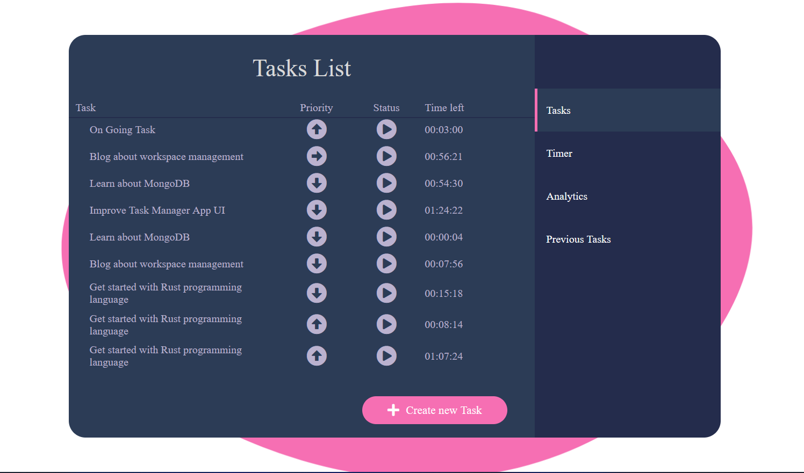
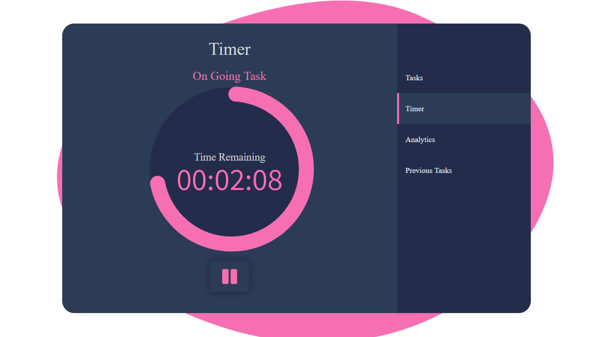
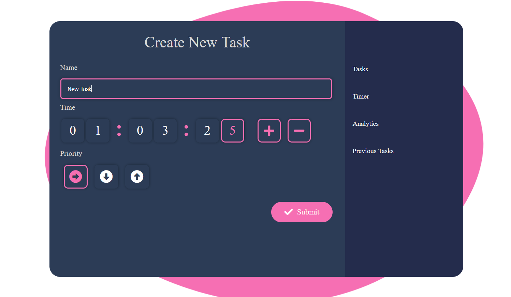
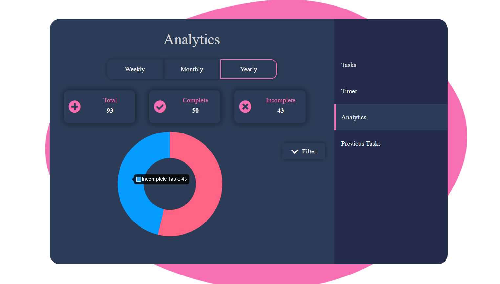
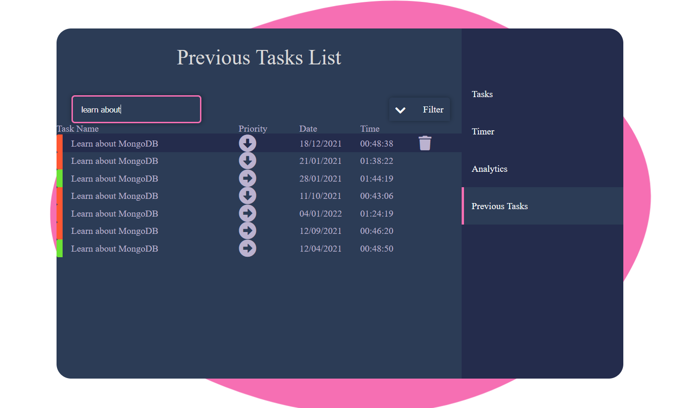

# Tasks-Manager

Task Manager, a simple web app which helps in organizing and prioritizing day today tasks. Manager comes with Analytics functionality which can provide insights about past tasks. Other features include adding timer to task and seaching through previous completed/failed tasks.<br>
The Project is live at <a href="https://projects.akshayrathi.com/task-manager/" target="_blank">link</a>

## Project Screen Shot(s)











## Installation and Setup Instructions

Clone down this repository. You will need `node` and `npm` installed globally on your machine.

Installation:

```
npm install
```

To Start Server:

```
npm start
```

To Visit App UI:

```
localhost:3000
```

## Built With

The project has been build using below frameworks and tools:

- [Angular](https://angular.io/)
- [NestJs](https://nestjs.com/)
- [MongoDB](https://www.mongodb.com/)

## Authors

Developed By [Akshay Rathi](https://akshayrathi.com)

<p><a href="https://akshayrathi.com/" target="_blank"></a>&nbsp;&nbsp;&nbsp;&nbsp;<a href="https://projects.akshayrathi.com/" target="_blank"></a>&nbsp;&nbsp;&nbsp;&nbsp;<a href="https://www.linkedin.com/in/akshay-rathi-sde/" target="_blank"></a>&nbsp;&nbsp;&nbsp;&nbsp;
</p>

## Acknowledgments

Design Inspiration

- [UI Design Daily](https://www.uidesigndaily.com/)
